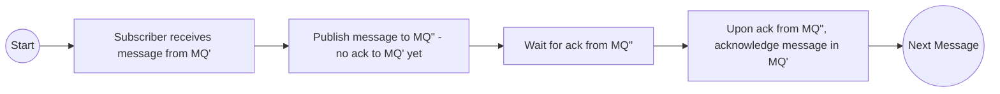

# Generic-Message-Queue-Bridge
A generic bridge to relay messages between different MQs fast and safe
## Guarantee
This bridge emphasises speed and message safety. Message ordering is not always guaranteed but in a best-effort manner.
## Core Flow

# This Repo is under development. Please message if you have specific broker technology that you want to be supported.
